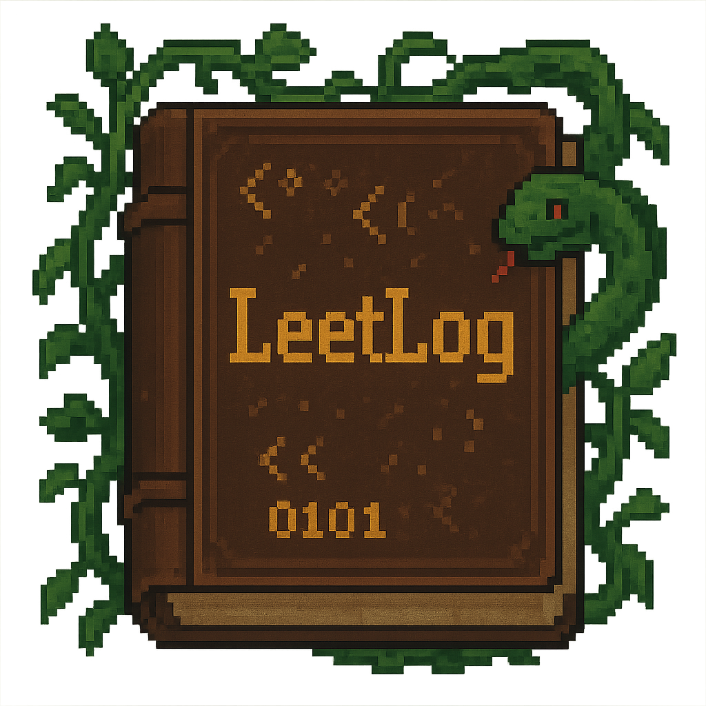

<div align="center">

</div>

**Built for personal LeetCode progress tracking; not intended for public use.**

A simple CLI tool to track your progress on LeetCode study plans. This provides an alternative to LeetCode's built-in tracking system, which can become cluttered and difficult to manage when you've already completed problems from a study plan independently.

## Installation

Install using [uv](https://github.com/astral-sh/uv) directly from the repository:

```bash
uv tool install git+https://github.com/jhrudden/leetlog.git
```

## Usage

### Initialize a study plan

Fetch a LeetCode study plan and set up local tracking:

```bash
leetlog init <plan-slug>
```

### Mark problems as complete

Track your progress by marking questions as completed:

```bash
leetlog complete <question-id>
```

### Sample random problems

Get a random selection of unanswered problems from your plan:

```bash
leetlog sample <count>
```

## Features

- **init** - Fetch and initialize tracking for any LeetCode study plan
- **complete** - Mark individual problems as completed in your local progress
- **sample** - Randomly select unanswered problems to work on next
